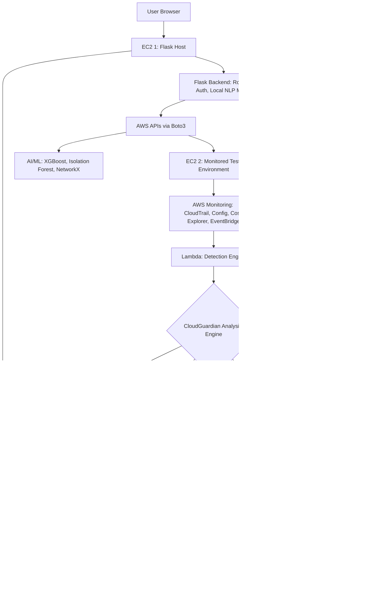

# CloudGuardian — System Architecture

## Overview

CloudGuardian is composed of two AWS environments (the Flask application host and a separate monitored/test environment), a real-time AWS-native detection pipeline, an AI analysis layer, and an automated remediation system — all surfaced through a Flask dashboard.

## Architecture Diagram

## Component Breakdown

### 1. Presentation Layer
- Flask Web App (EC2 1): Serves the dashboard, findings list, IAM graph visualization, cost charts, and the Simulate Attack demo button.
- Flask Backend: Handles routing, authentication (single admin user via Flask-Login), business logic, and hosts the local NLP summarization model.

### 2. Monitored Environment
- EC2 2: A deliberately separate, disposable environment containing test resources (EC2, S3, IAM, VPC) that CloudGuardian monitors and can safely misconfigure for demonstration purposes.

### 3. AWS Monitoring Layer
- AWS Config: Evaluates resource configurations against defined rules (public S3 buckets, open security groups, unencrypted volumes).
- CloudTrail: Records all account activity, feeding the behavioral anomaly detection model.
- Cost Explorer API: Tracks spending patterns for the cost anomaly detection module.
- EventBridge: Triggers Lambda functions in real time when Config compliance state changes.

### 4. Event Processing and Analysis
- Lambda (Detection Engine): Receives EventBridge triggers and routes findings into the CloudGuardian Analysis Engine.
- Analysis Engine splits findings into four parallel evaluation paths: Security Analysis, Behavior Analysis (XGBoost), IAM Analysis (NetworkX), Cost Analysis.

### 5. Risk Engine
- Aggregates outputs from all four analysis paths into a single risk score (0-100) and severity label (Low to Critical).

### 6. Explanation and Remediation
- NLP Explanation: A locally-hosted summarization model (distilbart-cnn-6-6) generates a plain-English explanation of what happened, why it is dangerous, and how it was fixed.
- Remediation Engine: Lambda and Step Functions execute multi-step automated fixes.

### 7. Data and Presentation
- DynamoDB: Central store for findings, risk scores, incidents, and remediation actions.
- Flask Dashboard: Displays all findings live, categorized by Security, Anomalies, IAM Risks, Cost, and Remediation status.

## Design Decisions

- Two-EC2 separation keeps the Flask application isolated from the resources being tested/monitored.
- Daily Config recording frequency minimizes AWS Config costs while remaining within Free Tier and credit budget constraints.
- Local NLP model avoids rate-limiting and external dependency issues during live demonstrations.
- IAM analysis is handled via direct boto3 calls rather than AWS Config, since IAM resource types were not available for per-type Config recording in this account/region setup.